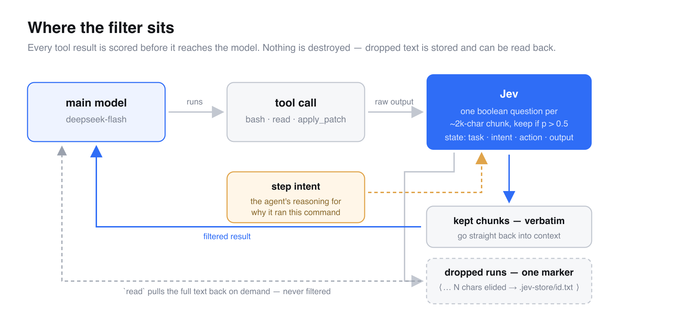
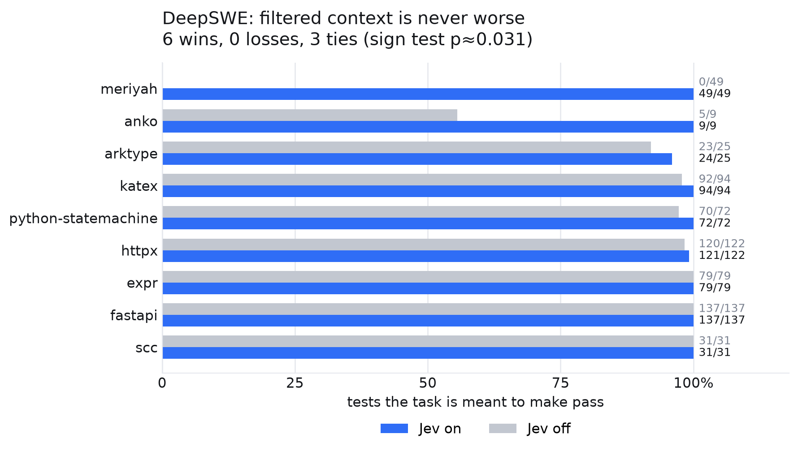
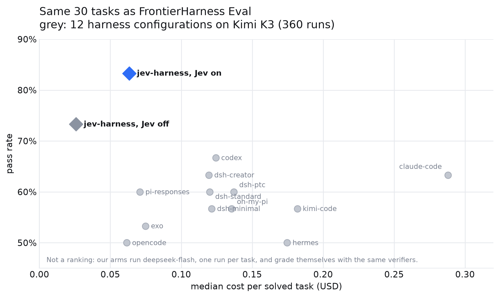

# jev-harness

A minimal coding agent that filters every tool result through a small relevance
model ([Jev](https://vercel.com/ai-gateway/models/jev)) before the main model
sees it, plus an A/B harness that runs the same tasks with filtering on and off.

The question: can a clean, filtered context plus a cheap model match a
conventional harness at lower cost?



## Latest outcome: TB4 follow-up, September 22, 2026

**The current integration did not demonstrate enough value to justify default
adoption or further large-scale runs. The experiment is closed.**

On 49 scored TB4 pairs, Jev on passed 2 tasks versus 5 for off, used 11.78%
more cumulative input tokens, and incurred 8.17% more estimated model cost.
Mean per-task test pass fractions were 44.27% versus 48.04% on 42 pairs with
test counts in both arms. Infrastructure costs are separate.

Trajectory inspection found unbounded-output failures, environment limitations,
and divergent execution paths. The result does not establish that Jev is
generally ineffective or that filtering caused the success-rate difference.
It does establish that this implementation has not demonstrated an end-to-end
benefit sufficient to justify its added complexity.

Read the [TB4 report and trajectory analysis](TB4-CONCLUSION-2026-09-22.md)
and [per-task metric snapshot](tb4-results-2026-09-22.json).
The experiment VM has been deleted and automatic reruns disabled.

## Earlier 30-task prototype

The following results belong to the earlier experiment. They are retained as
historical evidence and are not pooled with, or a substitute for, the TB4 follow-up.

On 30 tasks (Terminal-Bench 2.1 + DeepSWE), one run per arm, with
`deepseek-flash` as the main model:

| | pass@1 | cost | cost per passing task |
|---|---|---|---|
| Jev on | **25 / 30** | $2.82 | **$0.113** |
| Jev off | 22 / 30 | $2.80 | $0.127 |

The gap is entirely on DeepSWE (6/9 vs 3/9); on Terminal-Bench the two arms tie
at 19/21.

Read at test granularity — DeepSWE's verifier reports how many of a task's new
tests pass, not just whether all of them do — **the filtered arm is never worse
on any of the 9 tasks: 6 wins, 0 losses, 3 ties** (sign test, p≈0.031). The
clearest case is `meriyah`: 49/49 tests with the filter, 0/49 without, where
the unfiltered agent was shown 1.46M characters of tool output and ran out of
time.



Plotted against the 12 harness configurations FrontierHarness Eval ran on the
same 30 tasks — a different model (Kimi K3) and 360 runs, so this places our
arms, it does not rank them:



See [RESULTS.md](RESULTS.md) for per-task numbers and caveats. One run per arm:
this is a prototype measurement, not a generalization claim. Figures are
regenerated with `uv run --with matplotlib scripts/plot_results.py`.

## How it works

- Main model over the OpenAI Responses API (`deepseek-flash` supports it natively).
- Three tools only: `bash`, `read`, `apply_patch`.
- Every tool result except `read` goes through Jev first: the output is split
  into ~2k-char chunks on line boundaries, and each chunk gets one boolean
  question — *does this part contain information the agent is looking for in
  this step, or otherwise needs to complete the task?* Chunks are kept at
  p > 0.5; dropped runs collapse into `⟨… N chars elided → full output: PATH ⟩`.
- The raw output is always stored at `.jev-store/<call_id>.txt`, and `read` can
  retrieve it. Filtering is a routing decision, never destruction.
- Jev failures fail open: the unfiltered output is returned and the error logged.

### Intent in the earlier filtering experiments

The filter state is `{task, intent, action, output_parts}`, where **intent is
the agent's own reasoning from the turn that issued the tool call** — *why* it
ran the command.

Relevance is a property of the step, not of the task. `sed -n '360,500p'
vm/vmStmt.go` looks like noise against a task description, but it is exactly
what the agent just asked for. Without intent, Jev scored such deliberate reads
at p≈0.1–0.4 and elided them whole; the agent then saw only the marker and
`read` the raw output straight back.

In the first 11 on-arm runs, 49 elided outputs were read back — 39 of them
fully elided — returning ~281k of the ~285k characters cut. Net saving: zero,
plus the extra turns. Replaying the same 63 decisions with intent added, fully
elided outputs that had been read back fell from 33 to 12, and most of the
remainder were off-task probes (setup logs, web searches) where dropping is
correct.

Two smaller rules come from the same evidence:

- **Contains-signal, not majority-noise.** A chunk is kept if even one line in
  it is useful. The "is this part noise?" framing tested worse: it drops a chunk
  that is 99% digits with one ERROR line.
- **Single-chunk outputs skip Jev entirely.** With one part, filtering is
  all-or-nothing, and dropping a whole short output (a 46-char `Success` went
  this way) is the costliest error direction.

## Usage

```bash
export DEEPSEEK_API_KEY=...       # or set MODEL / DEEPSEEK_BASE_URL to swap model/gateway
export AI_GATEWAY_API_KEY=vck_... # Vercel AI Gateway key

uv run jev_agent.py --task instruction.md --workdir ./task-env --jev on  --log run-on.jsonl
uv run jev_agent.py --task instruction.md --workdir ./task-env --jev off --log run-off.jsonl
```

`--jev off` is the control arm: same harness, no filtering. The JSONL log
records per-chunk probabilities, keep/drop decisions, latency, model usage, and
`tool_io.shown` — the exact text the model saw, enough to rebuild the trajectory.

In an eval runner, pass keys as `--secrets FILE` instead: the agent loads the
file and deletes it, so its own `bash` tool cannot find them. This is not
hypothetical — agents `cat`-ed a sourced secrets file and used the gateway key
to call other models.

### Running the A/B evaluation

`run_task.sh` runs one task in both arms inside a container on a
[Runta](https://runta.dev) runtime, then grades it with the benchmark's own
verifier; `run_batch.sh` drives a set of tasks, launching each task's two arms
simultaneously so both see the same machine load. `summarize.py` pairs the runs
and prints pass/cost per task.

```bash
./run_batch.sh <runner> <tasks-in-parallel> [task...]
python3 summarize.py runs/
```

The task set is [frontier-harness-eval](https://runta.dev): 21 Terminal-Bench
2.1 tasks and 9 DeepSWE tasks. Runs are unranked internal comparisons, not
leaderboard submissions.

## Protocol notes (verified against the live DeepSeek Responses API)

- `function_call_output` must echo `call.call_id`, not the item `id`.
- **All response items for a turn must enter `input` before any
  `function_call_output`.** Interleaving an output between function calls
  detaches the later calls from their reasoning, and the next request is
  rejected with 400 ("reasoning_text in the thinking mode must be passed back").
- `apply_patch` uses the Codex patch grammar (`*** Begin Patch` / `Add File` /
  `Update File` with `@@` anchors / `Move to` / `Delete File` / `End Patch`).
  Unlike Codex it stays a JSON function wrapper `{patch: ...}`, because DeepSeek
  custom-tool support is unverified. Patches are validated in memory before any
  write, paths are confined to the workdir, and CRLF / non-UTF-8 files
  round-trip byte-safely.
- Python ≥3.13 enables `VERIFY_X509_STRICT` by default, which rejects a MITM
  egress certificate that carries no Authority Key Identifier. The agent clears
  that one flag rather than disabling verification.

## Status

A closed prototype experiment. The earlier 30-task result was encouraging,
but the later TB4 evaluation did not establish sufficient value for the current
integration. Both used one run per arm and a single main model; neither
establishes general effectiveness. See the [final report](TB4-CONCLUSION-2026-09-22.md)
for the decision, evidence, and limitations.

## License

Apache 2.0
